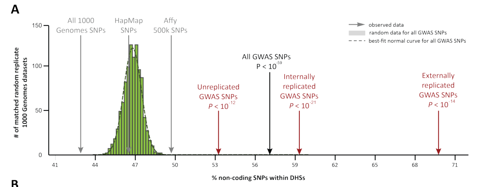

```{r setup, include=FALSE}
knitr::opts_chunk$set(echo = FALSE)
pacman::p_load(
  tidyverse,
  stringr,
  forcats,
  magrittr
)
```

## GWAS SNPs associated with cell type specific DHS sites
This figure visualize the relationship between disease associated SNPs and DHS sites from various cell types. I used the CEU subset of the 1000genome project to find all SNPs in strong LD with the 62 GWAS tag SNPs associated with CeD.

Indeed, gluten specific T-cell clones and Encode's Th-1 and Th-17 cell lines have the strongest association with celiac GWAS associated SNPs.    


```{r include = FALSE}
# input file generated in "dhs_SNP_stats.R"
gced_df <- read_csv('output_data/DHS_CeD_LD_summary.csv') %>% 
  dplyr::mutate(group = fct_relevel(group,
                             'TCC-0', 'TCC-10', 'TCC-30', 'TCC-180',
                             'T-naive', 'Th-1', 'Th-2', 'Th-17', 'T-reg', 'Jurkat'))
```

```{r}
gced_df %>%
  ggplot(aes(x = group, y = snp_per_kb, color = group)) +
  geom_boxplot() +
  xlab('T-cell type') +
  ylab('SNPs per kbp open chromtin at CeD loci') +
  theme(legend.position = "none") + # removes legend
  ggtitle('SNPs in DHS sites at CeD loci',
          subtitle = 'SNPs are in strong LD with CeD GWAS tag SNPs') +
  labs(caption = 'Number of SNPs is normalized by cell type\'s DHS coverage in CeD Loci.\nInspired by figure 3 in Maurano et. al 2012')
```

## SNP DHS overlap increases with GWAS P-value significance
Maurano et al fig 5 illustrates that the association between disease associated SNPs and DHS sites is stronger in disease relevant cell types.
They also show that the association increases with P-value significance.

We recreate this plot using Celiac Disease data and relevant cell types.
I used the top 1000 tag SNPs from Dubois et al 2010. 
Most of these SNPs did not reach genome wide significance, but they do have a low enough 
P-value to be potentially interesting.
We compute fold change for P-value interval *i* and cell type *k* in the following manner:

 * $G$ total number of SNPs.
 * $D_k$ number of SNPs within DHS sites for cell type *k*.
 * $P_i$ is the number of SNPs in P-value category *i*.
 * $D_k P_i$ is the number of SNPs in P-value category *i* within cell type *k* DHS sites.
$$F_{ik}=\frac{
\frac{D_kP_i}{P_i}}{
\frac{D_k}{G}
}$$


```{r include = FALSE}
# from ced_top_snp_dhs_fold_change_over_genome_avg.R
snp_df <- read_csv('output_data/Maurano_2012_fig5_inspired_data.csv') %>% 
  dplyr::mutate(
    pcat = fct_relevel(pcat, "2.5e-4<5e-4", "1e-4<2.5e-4", "1e-5<1e-4", "<1e-5"))  
```
```{r}
snp_df %>%
  mutate(
    group = fct_reorder(group, median_fchange),
    fold_change = log(fold_change)
  ) %>%
  ggplot(aes(group, fold_change, color = pcat)) +
  geom_boxplot() +
  scale_color_discrete(name = 'P-value groups') +
  labs(
    title = 'SNPs in DHS sites per cell type for top 1000 CeD GWAS SNPs ',
    subtitle = 'Fold change for Dubois SNPs\' assoiciation with DHS sites over genome average for cell type.',
    x = '',
    y = 'Log Fold Change',
    caption = 'SNP P-values from supplemental material in Dubois et al 2010.
    Inspired by figure 5 in Maurano et. al 2012'
  ) 
```


## A misleading aspect of Maurano et al 2012
I believe the paper presents two key messages:

1. A disease associated SNP is **most likely within a DHS site** in a disease relevant cell type.
2. More significant GWAS SNPs increases the likelihood of a DHS site presence.

I don't think it makes the paper less interesting, but the authors have a very lenient definition of a DHS site.
This incorrectly give the impression of an almost 1:1 relationship with disease associated SNPs and DHS sites in disease relevant cell types.
I will show why below, but I think a more honest key message would have been:

1. A disease associated SNP is **most likely not within heterochromatin** in a disease relevant cell type.
2. More significant GWAS SNPs increases the likelihood of a DHS site presence.

Maurano et al 2012 do not explicitly describe how they define DHS regions and what proportion of the genome they cover. They do not mention at all how they define DHS regions in a cell type agnostic manner, but it seems to be a union of all cell types. 

43% of all 1000 genome SNPS is covered by a DHS according to the figure below (Maurano et al 2012 Fig S2A). The 1000genome SNPs are essentially all common SNPs (minor allele frequency > 1%) which densely covers most of the genome. 
This would indicate that at least ~40% of the genome is covered by DHS sites according to Maurano et al. 
This is in stark contrast to how the rest of the Encode consortium have processed and published the same data where about 30 Mbp (or about 0.01% of the genome) is covered by DHS sites.



## How many CeD SNPs are overlapping DHS sites for various cell types?
We have seen that we are able to detect the same trends as Maurano et al for CeD. 
This time we look at the counts to give an impression of the proportion of disease relevant SNPs covered by DHS sites.
We use the same dataset as in the first figure.

```{r}
gced_df %>% 
  mutate(covMB = tot_cov / 1e3,
         covType = cut(
           covMB, 
           c(0, 20, 30, 40, 100),
           labels = c('< 20Mb', '20-30Mb', '30-40Mb', '> 40Mb'))) %>% 
  ggplot(aes(name, num_snp, color= covType)) + 
  geom_point() +
  scale_color_discrete(name = 'DHS Coverage') +
  ggtitle('Number of 1260 CeD LD SNPs in DHS sites',
          subtitle='Results not normalized but color indicates DHS coverage.') +
  coord_flip()
```

**At most 7%** of the disease relevant SNPs are within DHS sites for our data.


## CeD eQTL DHS association by P-value intervals
It would be very interesting if the eQTLs and DHS sites would have the same correlation trend as GWAS SNPs and DHS sites. Sadly, that might not be the case.
It is important to note that these eQTLs are found using a relatively small cell number and biologically related samples. For example, only 75 of the 1309 eQTLs are within CeD loci identified by GWAS. We might get better results with a more well powered study.


```{r include = FALSE}
# from eQTL_FDR_dhs_fold_change_over_genome_avg.R
snp_df <- read_csv('output_data/Maurano_2012_fig5_inspired_eqtl.csv')
```
```{r}
snp_df %>%
  mutate(
    group = fct_reorder(group, median_fchange),
    fold_change = log(fold_change)
    
  ) %>%
  ggplot(aes(group, fold_change, color = group)) +
  geom_boxplot() +
  theme(legend.position = "none") + # removes legend
  labs(
    title = 'SNPs in DHS sites per cell type for 1309 CeD eQTLs',
    subtitle = 'Fold change over genome average for cell type. No correlation with P-value intervals (not shown).',
    x = '',
    y = 'Log Fold Change',
    caption = 'P-values from gsTCC eQTL study.\nInspired by figure 5 in Maurano et. al 2012'
  ) 
  

```

